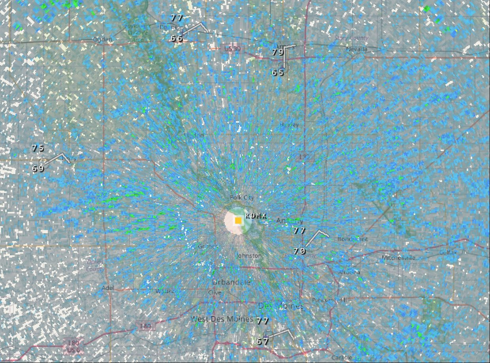
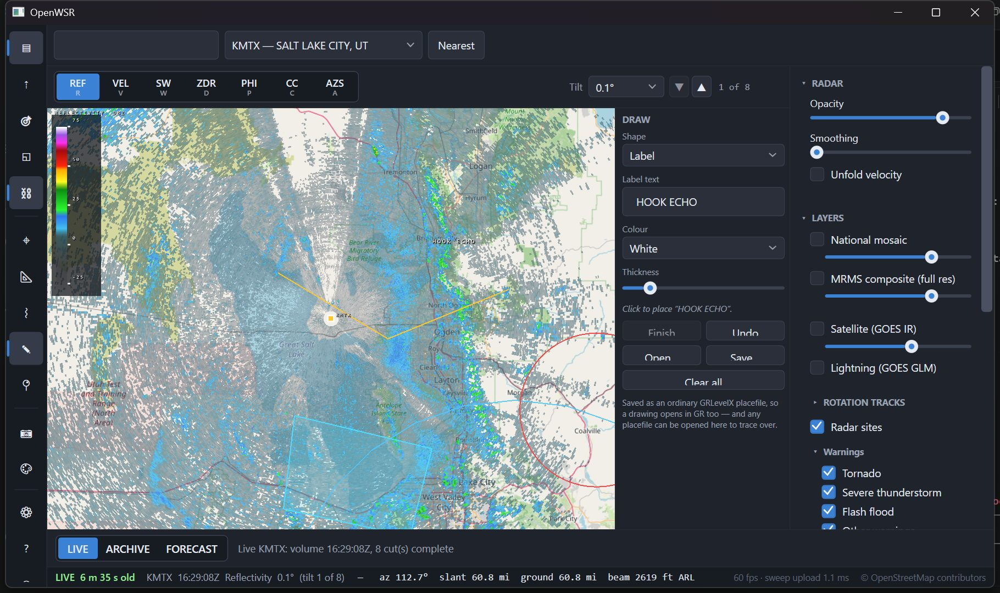
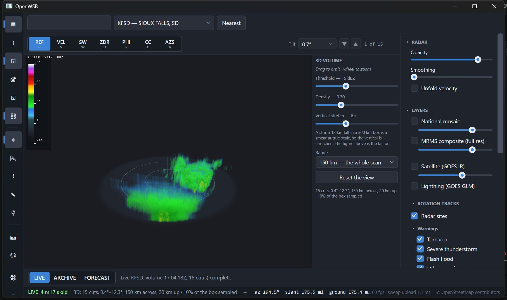

# OpenWSR documentation

Reference material that doesn't belong in the top-level [README](../README.md) (which is
for users) or [CLAUDE.md](../CLAUDE.md) (which is the working brief).

| Document | What's in it |
|---|---|
| [formats.md](formats.md) | Binary format field notes — the parts that cost real debugging time. Level II, Level III, GRIB2, placefiles |
| [verification.md](verification.md) | How each decoder is golden-tested against MetPy and ecCodes, and how to run a cross-check |
| [data-sources.md](data-sources.md) | Every endpoint, the specs behind them, and which ones have already moved |
| [parity.md](parity.md) | Competitive gap analysis, annotated with what's since been closed |
| [parity-scan.html](parity-scan.html) | The original presentation version of that analysis — open in a browser |
| [evidence-live-soak-30min.log](evidence-live-soak-30min.log) | Raw log from the 30-minute live ingestion soak |
| [screenshots/build-log/](screenshots/build-log/) | Working captures from the build, including the symptoms of bugs worth recognising again |

Related: [`resources/`](../resources/) holds the runnable inputs — cross-check scripts,
sample placefiles, reference tables — and
[`resources/measurements/`](../resources/measurements/) the harnesses that re-derive every
number quoted in `verification.md`. A figure nobody can reproduce is a figure nobody can
argue with.

---

## Screenshots

All captured from the running app against real weather.

### Interface

The left nav rail, layers panel, unified timeline with hour ticks, and the D3D-drawn
colour scale. Everything on the map — legend, labels, storm symbols — is drawn inside the
Direct3D scene rather than as WPF controls, because the child-HWND swapchain always draws
over WPF content. See the airspace note in [CLAUDE.md](../CLAUDE.md).

### Storm analysis

SCIT storm tracks with forecast positions and projection cones, hail markers sized by
severe-hail probability, and mesocyclone rings. Cones are ±15° out to a 60-minute
forecast, gated to cells moving faster than 3 km/h.

A true vertical slice through the volume. Sampling only the nearest elevation cut gives
useless diagonal streaks; this interpolates between the two bracketing cuts.

Tracked storm motion subtracted from velocity, so rotation stands out from translation.

### National context

National reflectivity mosaic, SPC outlooks, watch boxes and storm reports.

HRRR simulated reflectivity, decoded natively from GRIB2 and resampled from its Lambert
conformal grid into Web Mercator.

One click scans all 163 WSR-88Ds for peak digital VIL and flies to the heaviest
precipitation in the country. This is the fastest way to get real convection on screen
for testing.

### Smoothing

A continuous slider, not a toggle — a sentinel-aware variable-sigma Gaussian that
excludes no-data gates rather than smearing them into real returns.

| 0% (raw gates) | 50% | 100% |
|---|---|---|
|  |  |  |

`tools/smoothing-lab.html` reproduces the exact shader maths in a browser against
exported real sweep data, which is far faster to iterate on than rebuilding the app.

### Overlays and layout

GRLevelX community placefiles, with per-file refresh intervals and per-item zoom
thresholds honoured.

Icon sheets, drawn from the sprite grid the placefile names and turned to the bearing each
`Icon` statement carries — here the IEM ASOS feed, so every station shows its temperature,
dewpoint and wind barb. Sheets frequently ship with no alpha channel at all; the
convention is that black is the transparent colour, and keying it out is what turns a grid
of black tiles into artwork.

Lines, filled areas, circles and labels drawn by hand and saved as **ordinary GRLevelX
placefiles** — so a drawing opens in GR, can be handed to someone else, and comes back
through the parser that is already golden-tested.

1/2/4 panes with linked or independent pan.

### 3D volume

The whole volume resampled onto a Cartesian grid and ray marched, with a ground disc and
range rings for scale. Ray marching rather than an isosurface, so no dBZ threshold has to
be invented: weak echo stays as haze and a core is solid because a lot of it was
integrated. The vertical is stretched — a 12 km storm in a 300 km box is a smear at true
scale — and the factor is on screen rather than hidden.

Drag orbits, right-drag pans, the wheel zooms. Voxel zero means *unsampled*, never "weak",
which is what lets you see straight through the cone of silence and everything below the
lowest beam.
