# OpenWSR documentation

Reference material that doesn't belong in the top-level [README](../README.md) (which is
for users) or [CLAUDE.md](../CLAUDE.md) (which is the working brief).

| Document | What's in it |
|---|---|
| [formats.md](formats.md) | Binary format field notes — the parts that cost real debugging time. Level II, Level III, GRIB2, placefiles |
| [verification.md](verification.md) | How each decoder is golden-tested against MetPy and ecCodes, and how to run a cross-check |
| [data-sources.md](data-sources.md) | Every endpoint, the specs behind them, and which ones have already moved |
| [parity.md](parity.md) | Competitive gap analysis, annotated with what's since been closed |
| [parity-scan.html](parity-scan.html) | The original presentation version of that analysis — open in a browser |
| [evidence-live-soak-30min.log](evidence-live-soak-30min.log) | Raw log from the 30-minute live ingestion soak |

Related: [`resources/`](../resources/) holds the runnable inputs — cross-check scripts,
sample placefiles, reference tables.

---

## Screenshots

All captured from the running app against real weather.

### Interface

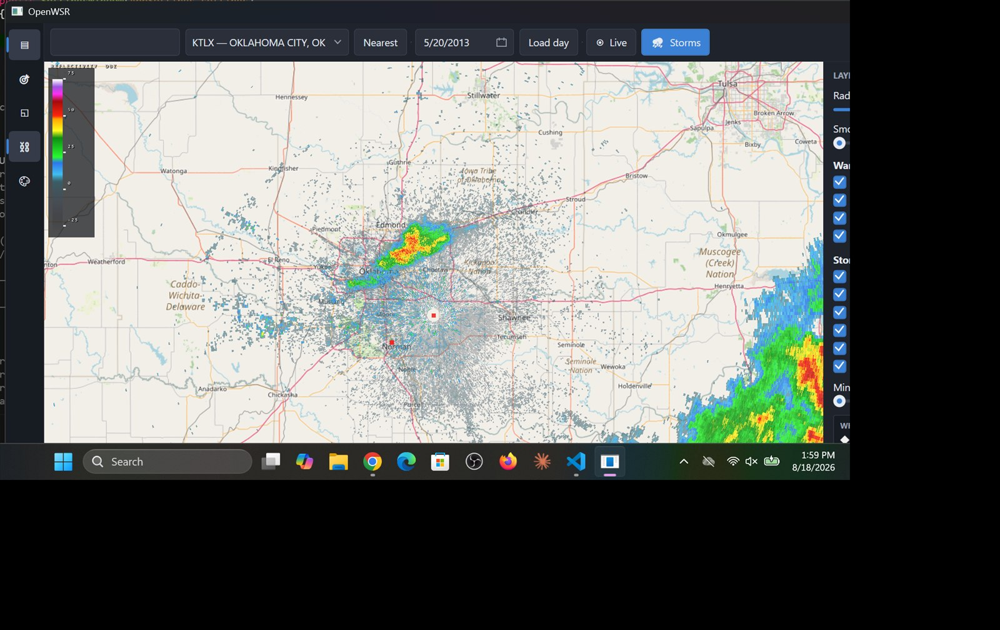

The left nav rail, layers panel, unified timeline with hour ticks, and the D3D-drawn
colour scale. Everything on the map — legend, labels, storm symbols — is drawn inside the
Direct3D scene rather than as WPF controls, because the child-HWND swapchain always draws
over WPF content. See the airspace note in [CLAUDE.md](../CLAUDE.md).

### Storm analysis

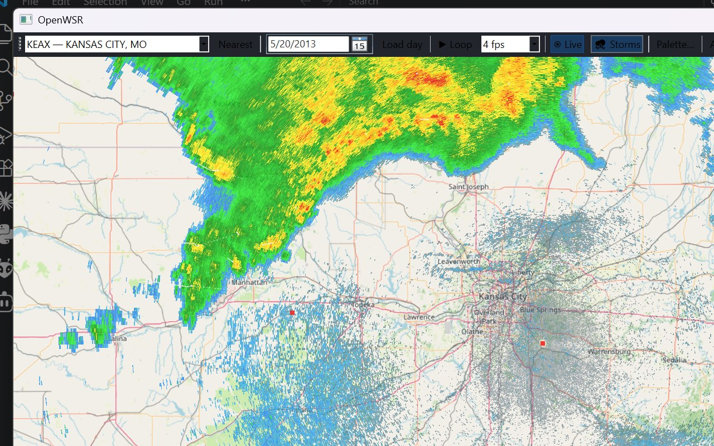

SCIT storm tracks with forecast positions and projection cones, hail markers sized by
severe-hail probability, and mesocyclone rings. Cones are ±15° out to a 60-minute
forecast, gated to cells moving faster than 3 km/h.

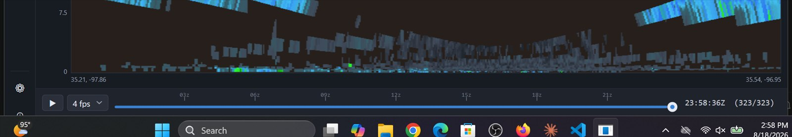

A true vertical slice through the volume. Sampling only the nearest elevation cut gives
useless diagonal streaks; this interpolates between the two bracketing cuts.

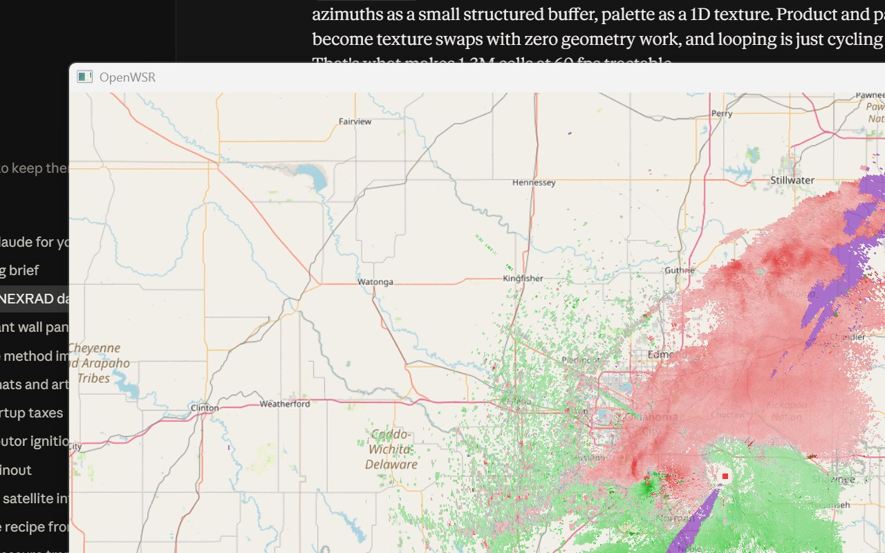

Tracked storm motion subtracted from velocity, so rotation stands out from translation.

### National context

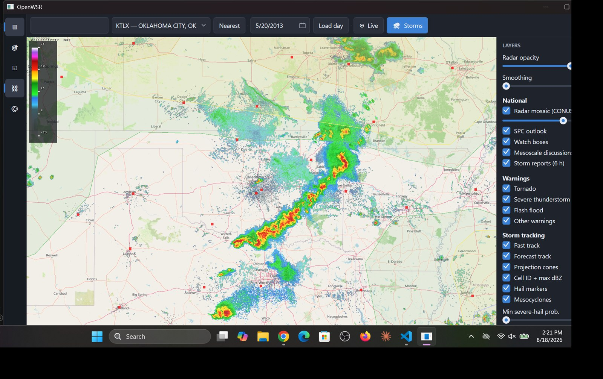

National reflectivity mosaic, SPC outlooks, watch boxes and storm reports.

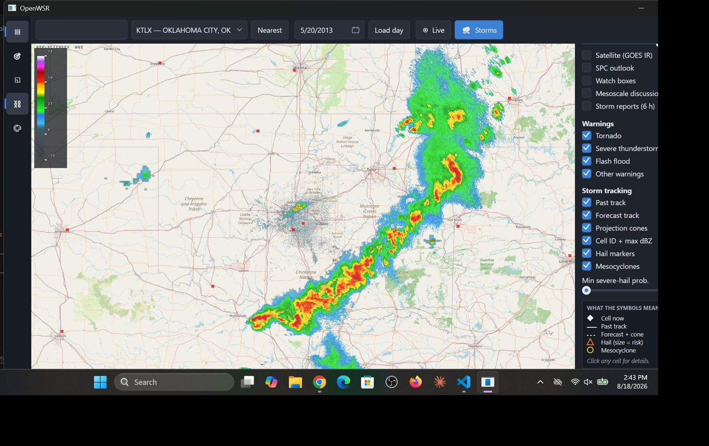

HRRR simulated reflectivity, decoded natively from GRIB2 and resampled from its Lambert
conformal grid into Web Mercator.

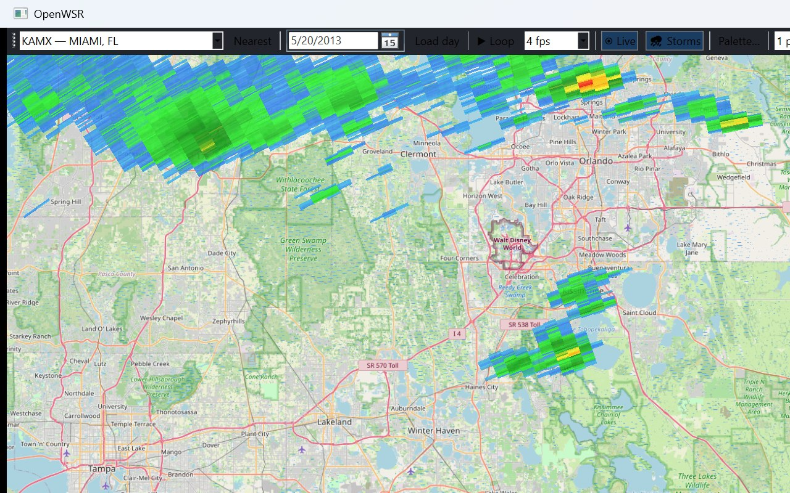

One click scans all 163 WSR-88Ds for peak digital VIL and flies to the heaviest
precipitation in the country. This is the fastest way to get real convection on screen
for testing.

### Smoothing

A continuous slider, not a toggle — a sentinel-aware variable-sigma Gaussian that
excludes no-data gates rather than smearing them into real returns.

| 0% (raw gates) | 50% | 100% |
|---|---|---|
| 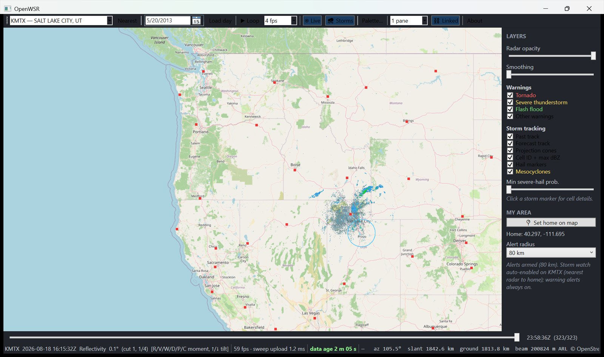 | 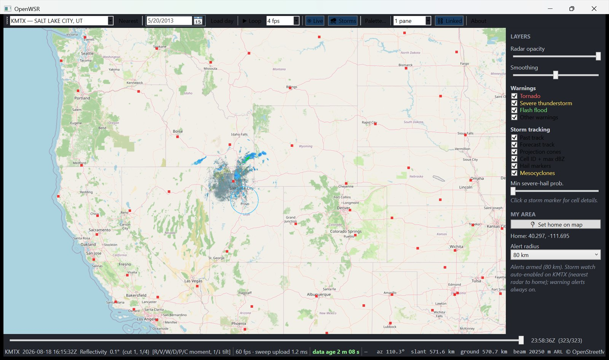 | 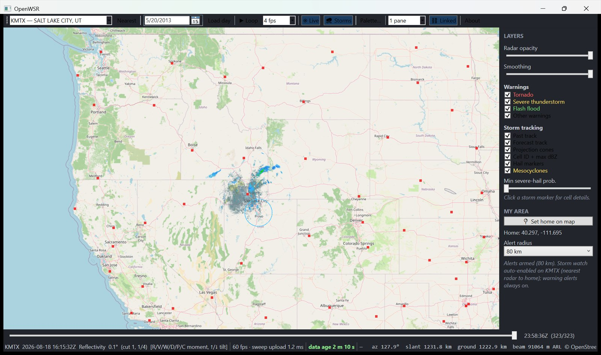 |

`tools/smoothing-lab.html` reproduces the exact shader maths in a browser against
exported real sweep data, which is far faster to iterate on than rebuilding the app.

### Overlays and layout

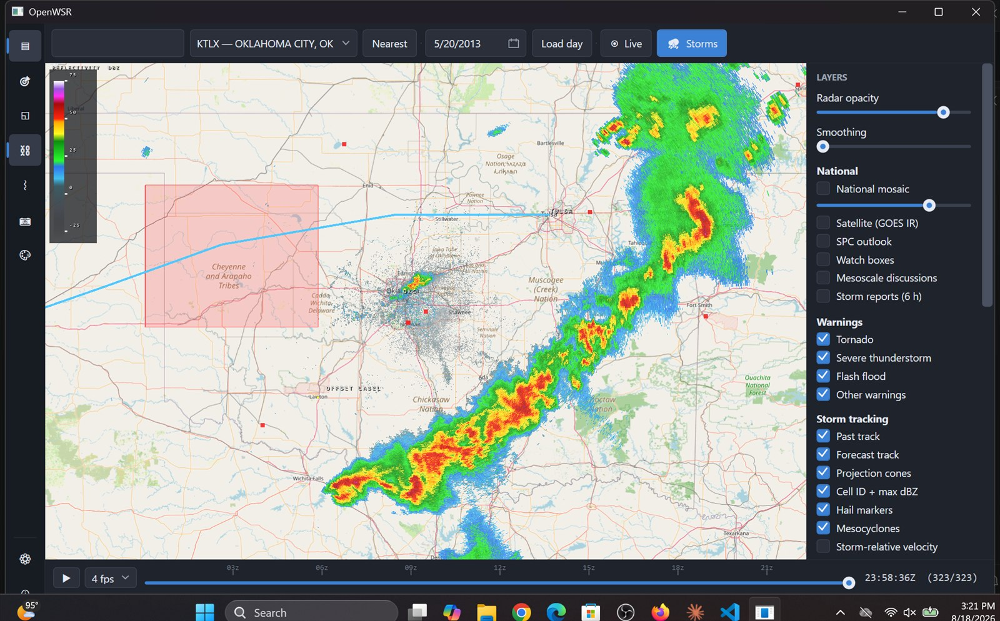

GRLevelX community placefiles, with per-file refresh intervals and per-item zoom
thresholds honoured.

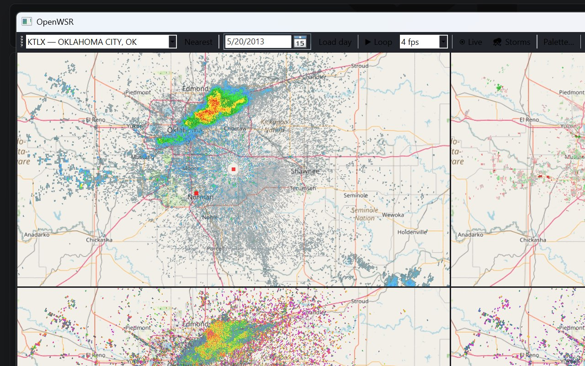

1/2/4 panes with linked or independent pan.
